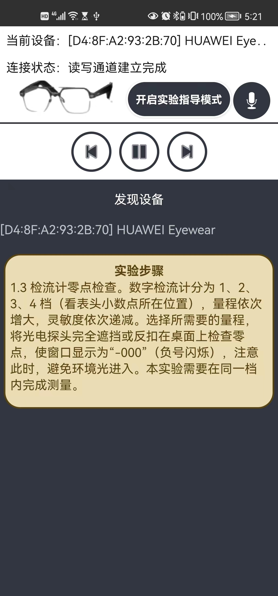
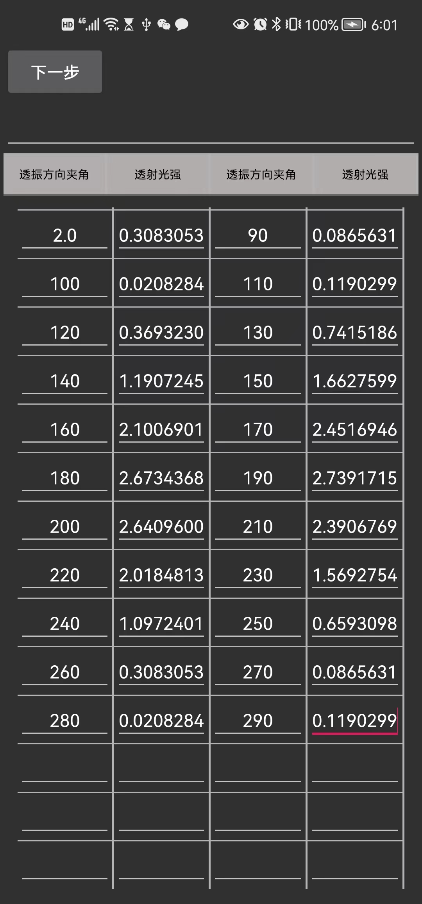

# Expericorder

This project is an Android application supported by Huawei Eyewear, focusing on improving the efficiency in recording data when doing Physics experiments. Expericorder uses voice input to send data from the Huawei Eyewear to the mobile application, and the app fills the table automatically. Our solution has the advantage that students can effortlessly record their experiments and process the resultant data efficiently. 

## Features

- use voice input to send data and fill the table 
- use interactions (inclcuding knocking and head movements) with Huawei Eyewear to control the app

## Requirements

- Java SDK jdk8u_291 or higher
- Android Studio

## Building

Use Java 8 and execute the following command to build the apk.

```
$ ./gradlew build
```

## Project structure

```
├─ app
    ├─ libs               
    └─ src/main            
    	├─ assets/iflytek
    	└─ java/com/huawei/audiodevicekit # core code
    	└─ jniLibs
    	└─ res
    	└─ AndroidManifest.xml
    └─ .gitignore
    └─ build.gradle
    └─ proguard-rules.pro
├─ gradle/wrapper          
├─ .gitignore              
├─ build.bat               
├─ build.gradle            
├─ gradle.properties
├─ gradlew
├─ gradlew.bat
├─ settings.gradle
├─ PPT                     		# The ppt of the project
├─ doc
    ├─ Abstract.docx       		# The abstract of the project
    └─ pre.pptx                 # The ppt of the project
```

## User Guidance

Demo video: refer to doc/pre.pptx
